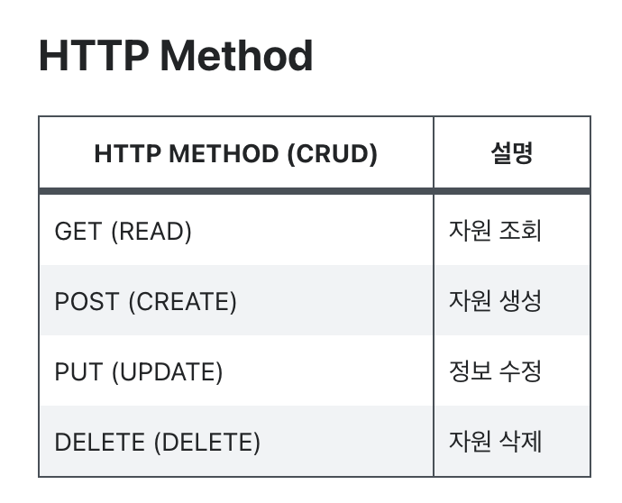

# RSET

    

## 🗣 REST의 정의
> *Representational State Transfer*의 약자로, 
***자원을 이름으로 구분하여 해당 자원의 상태를 주고 받는 모든 것***을 의미한다. 

 

자원은 해당 소프트웨어가 관리하는 모든 것을 의미하며, 뭐 예를 들면 DB 안에 들어가 있는 데이터 하나하나, 이미지 하나하나 등을 의미할 수 있겠다.

 

그리고 자원의 상태를 주고 받을 때, HTTP 프로토콜을 이용하니 우리(클라이언트)가 웹을 이용하며 자원을 **요청**(Request)하면 서버(Server)에서 자원을 **전달**(Response)해준다. 
`보통 JSON 형태나 XML 형태를 이용하여 자원의 상태를 전달하게 된다.`

 

추가적으로 REST는 [**ROP**]()(Resource Oriented Architecture)다. 
자원 지향 설계라고하는데 [**OOP**](),[**AOP**]()와 같이 프로그래밍 기법이 있다면, 이는 설계 기법중 하나라고 생각할 수있다. 
간단하게 **자원들을 HTTP Method으로 처리하는 기법**이다. 그렇다면 이 때 **어떤 방법**(Method)으로 자원들을 주고받을까? 

    

