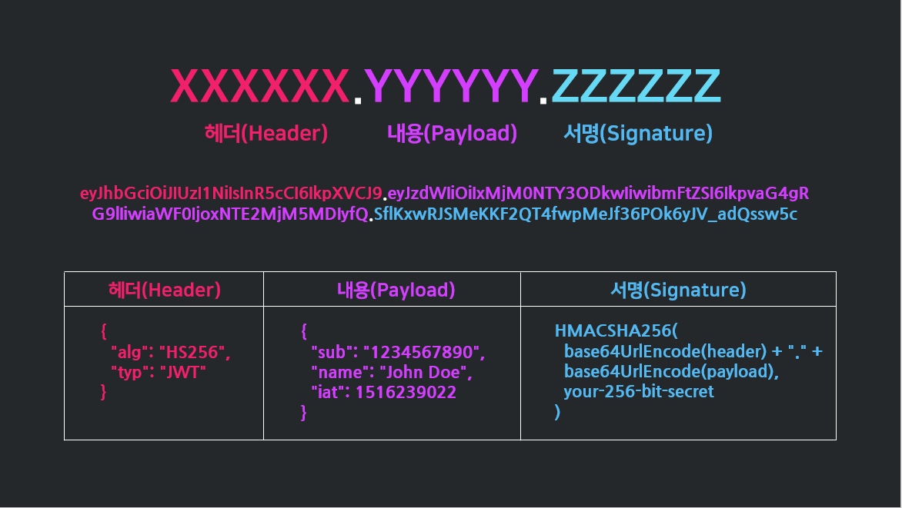

# 🗝 JWT

    

### 1️⃣ JWT 개념
> **Json Web Token**의 약자로,
> Json 포맷을 이용하여 사용자에 대한 속성을 저장하는 Claim 기반의 Web Token이다.

일반적으로 클라이언트와 서버, 서비스와 서비스 사이 통신 시 권한 인가(Authorization)를 위해 사용하는 토큰이다.

 

### 2️⃣ JWT 등장배경

### 3️⃣ JWT 특징
- 

### 4️⃣ JWT 구조

    

#### 📍 HEADER(헤더)
-  헤더(Header)는 JWT를 어떻게 검증(Verify)하는가에 대한 내용을 담고 있다.
#### 📍 PAYLOAD(내용)
#### 📍 Signature(서명)