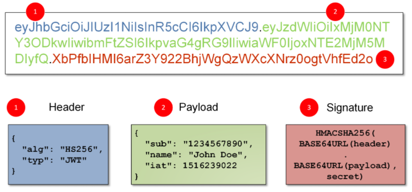

# 🗝 JWT

    

## 1️⃣ JWT 개념
> **Json Web Token**의 약자로,
> 일반적으로 클라이언트와 서버, 서비스와 서비스 사이 통신 시 권한 인가(Authorization)를 위해 사용하는 토큰이다.

 

## 2️⃣ JWT 등장배경

## 3️⃣ JWT 특징
이름에서도 알 수 있다시피 Json으로 인코딩되어있고,

Json 포맷을 이용하여 사용자에 대한 속성을 저장하는 Claim 기반의 Web Token이다.

JWT는 토큰 자체를 정보로 사용하는 Self-Contained 방식으로 정보를 안전하게 전달한다. 
주로 회원 인증이나 정보 전달에 사용되는 JWT는 아래의 로직을 따라서 처리된다.

## 4️⃣ JWT 구조

    

### 📍 HEADER(헤더)
### 📍 PAYLOAD(내용)
### 📍 Signature(서명)