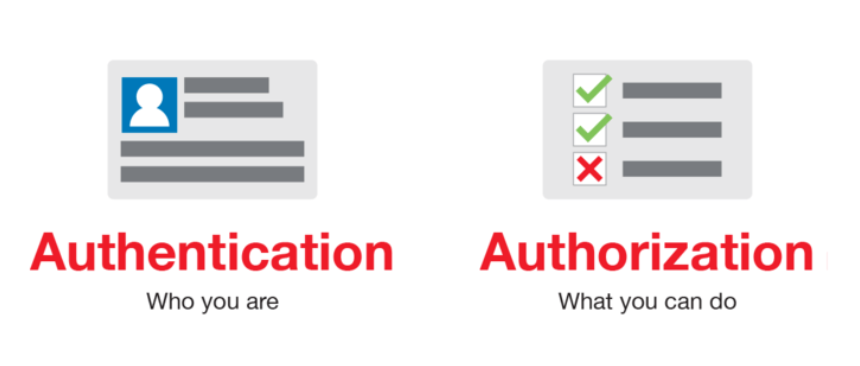

# 인증과 인가란?

    

## 🍎 인증(Authentication) & 인가(Authorization)
인증과 인가는 API에서 가장 많이 구현되는 기능 중 하나

---

### 1️⃣ 인증(Authentication)

유저의 identification을 확인하는 절차, 쉽게 설명하면 유저의 Id와 Password를 확인하는 절차, 
인증을 하기 위해선 먼저 유저의 Id와 Password를 생성할 수 있는 기능이 필요하다.

#### 📍 로그인 절차
1. 유저 Id와 Password 생성
1. 유저 Password 암호화 후 DB에 저장
1. 유저가 입력한 Password 암호화 후 암호화 돼서 DB에 저장된 유저 Password와 일치여부 비교
1. 일치하면 로그인 성공
1. 로그인 성공 후 access token을 클라이언트에게 전송
1. 로그인 성공 후에는 request에 access token을 첨부해서 서버에 전송함으로써 매번 로그인 할 필요가 없도록 한다.
 

#### 📍 유저 Password 암호화
* 유저의 비밀번호는 꼭 암호화 해서 DB에 저장해야 한다!

* 암호화에는 단방향 해쉬 함수(one-way hash function)가 일반적으로 쓰인다.

* 단방향 해시 함수는 원본 메시지를 변환하여 암호화된 메시지인 다이제스트(digest) 를 생성한다. 원본 메시지를 알면 암호화된 메시지를 구하기는 쉽지만 암호화된 메시지로는 원본 메시지를 구할 수 없어서 단방향성(one-way) 이라고 한다.

#### 📍 [Bcrypt](./Bcrypt.md)
#### 📍 [JWT](./JWT.md)

Bycrypt와 JWT는 내용이 좀 많아서 더 자세히 알아보았다.

---
### 2️⃣ 인가(Authorization)
유저가 요청하는 request를 실행할 수 있는 권한이 있는 유저인가를 확인하는 절차 
Authorization도 JWT를 통해서(access token을 통해 해당 유저의 권한 확인) 구현될 수 있다.

#### 📍 Authorization 절차
1. Authentication 절차를 통해 유저 정보를 확인할 수 있는 정보가 담긴(ex. user id) access token을 생성

2. 유저가 request를 보낼 때, access token을 첨부해서 보낸다.

3. 서버에서 유저가 보낸 access token을 복호화 한다.

4. 복호화된 데이터를 통해 user id를 얻는다.

5. user id를 사용하여 database에서 해당 유저의 권한을 확인

6. 유저가 충분한 권한이 있을 경우 해당 요청을 처리

7. 유저가 권한이 없다면 Unauthorized Response(401) 혹은 다른 에러코드를 보낸다.