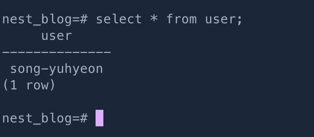

# select * from user가 테이블 내용 대신 시스템 사용자를 반환
만약 `user`라는 이름의 테이블을 만들고 그 테이블을 참조하려고 하였을 때, 일어나는 문제이다.<br>
위 명령어를 입력하면 내가 원하는 값이 아닌 엉뚱한 값이 나올 것이다.



위 사진은 내가 직접 겪었던 실제 사례를 찍어둔 예시이다.<br>
<br>

위 명령어인 `select * from user`는 시스템 사용자를 반환하는 명령어이다.<br><br>
꼭 `user`만 그런 것이 아니다.<br>
이 문제의 원인은 [예약된 키워드(reserved keyword)]((https://www.postgresql.org/docs/current/sql-keywords-appendix.html))로 table의 이름을 만들었기 때문이다.<br>
<br>

예약된 키워드로 Table의 이름들을 설정하는 것은 좋은 방법이 아니다.<br>
만약 설정이 되어있다면 테이블의 이름을 빠른 시일내에 바꾸는 것이 좋다.

```sql
ALTER TABLE [원본 테이블명] RENAME TO [바꾸려는 테이블명];
```

그리고 어쩔 수 없이 이 키워드로 계속 써야한다면,<br>
아래와 같이 큰 따옴표`("")`를 사용하여 테이블을 참조하길 바란다.<br>
```sql
SELECT * FROM "user";
```