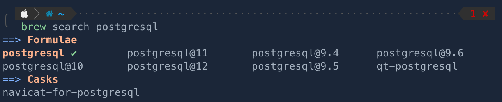
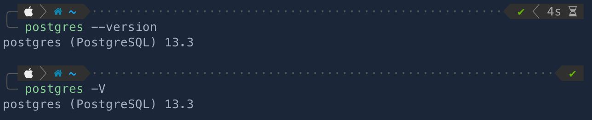
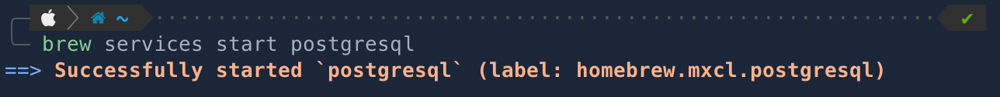

# How to install PostgreSQL 🐘
> 본 글은 MacOS에서 설치하고 있으며, [Homebrew](https://brew.sh/index_ko)라는 패키지 관리자를 사용하여 install합니다.

<br>

## PostgreSQL install

```shell
$ brew search postgresql
```
먼저, **hombrew🍺** 에 `postgresql` 패키지가 있는지부터 확인한다.



버전을 뒤에 적지 않고 postgresql이라고 입력하면 default값으로 가장 최신 버전의 패키지가 설치된다.

```shell
brew install postgresql
```
<br>

## Install confirm
```
postgres --version
```
혹은
```
postgres -V
```
설치가 정상적이라면 위 명령어를 통해 `postgresql`가 잘 설치되었는지와 어떤 버전이 설치되었는지 확인할 수 있다.


<br>

## Postgresql Start
설치된게 확인이 되었다고 해서, 무턱대고 DB명령어를 입력하면 에러가 날 것이다.
postgresql의 server를 켜야한다.

```
brew services start postgresql
```



<br>

server를 끄는 명령어는 이 반대이다.
```
brew services stop postgresql
```
