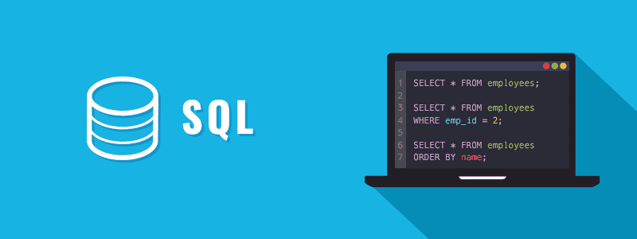
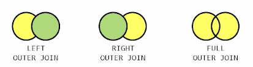

# 데이터베이스(SQL)
<div align="center">
    
</div>

> SQL은 **Structed Query Language (구조적 질의 언어)의 줄임말로, 관계형 데이터베이스 시스템(RDBMS)에서 자료를 관리 및 처리하기 위해 설계된 언어**입니다.

## 🦊 SQL 문법의 종류
SQL 문법은 크게 3가지의 종류로 나누어진다.
- [DDL]()
- [DML]()
- [DCL]()
---
### 📍 ***DDL*** (Data Definition Language) - 데이터 정의 언어
>  ***데이터 정의어*** 란?

데이터베이스 구조를 정의하는 언어이며, 데이터를 생성(CREATE), 수정(ALTER), 삭제(DROP)하는 등의 데이터 전체의 구조를 결정하는 역할을 하는 언어 입니다.<br>
<br>

|종류|역할|
|:---:|:---:|
|CREATE|객체 생성|
|ALTER|객체 수정|
|DROP|객체 삭제|
|TRUNCATE|객체 내용 삭제(초기화)|

#### ALTER TABLE
- **ADD `[COLUMN]` : 컬럼 추가**
```sql
ALTER TABLE 테이블명
ADD (COLUMN) 컬럼명 데이터 유형;
```

- **DROP COLUMN : 컬럼 삭제**
```sql
ALTER TABLE 테이블명
DROP COLUMN 컬럼명;
```

- **MODIFY COLUMN : 제약조건 변경**
```sql
ALTER TABLE 테이블명
MODIFY 컬럼명 데이터 유형;
```

- **RENAME COLUMN : 컬럼명 변경**
```sql
ALTER TABLE 테이블명
RENAME COLUMN 컬럼명 TO 새로운컬럼명
```

### 📍 ***DML*** (Data Manipulation Language) - 데이터 조작 언어
> ***데이터 조작어*** 란?

정의된 데이터베이스에 입력된 레코드를 조회하거나 수정하거나 삭제하는 등의 역할을 하는 언어를 말합니다.<br>
<br>

|종류|역할|
|:---:|:---:|
|SELECT|조회|
|INSERT|삽입|
|UPDATE|수정|
|DELETE|삭제|
### 📍 ***DCL*** (Data Control Language) - 데이터 제어 언어
> ***데이터 제어어*** 란?

데이터베이스에 접근하거나 객체에 권한을 주는등의 역할을 하는 언어를 입니다.<br>
<br>

|종류|역할|
|:---:|:---:|
|GRANT|권한 부여|
|REVOKE|권한 박탈|
|COMMIT|작업 완료|
|ROLLBACK|작업 취소 및 복구|
<br><br>

## 🐻 SQL 집합 연산자
- UNION(합집합 : **중복제거**)
- UNION ALL(합집합 : **중복 포함**)
- INTERSECT(교집합)
- MINUS(차집합)
<br><br>

## 🐶 JOIN
---
### OUTER JOIN(외부조인)
> **조인 조건에 만족하지 않는 튜플도 결과로 출력**하기 위한 조인
<div align="center">
    
</div>
<br>

`LEFT JOIN 문`
```sql
SELECT *(or 컬럼명)
FROM 테이블1
LEFT JOIN 테이블2
ON 테이블1.컬럼명 = 테이블2.컬럼명;
```
<br><br>

## 🐯 SELECT문 문법순서와 실행순서
- **문법순서**(작성순서)
`SELECT` 👉 `FROM` 👉 `WHERE` 👉 `GROUP BY` 👉 `HAVING` 👉 `ORDER BY`
<br>

- **실행 순서**
`FROM` 👉 `WHERE` 👉 `GROUP BY` 👉 `HAVING` 👉 `SELECT` 👉 `ORDER BY`