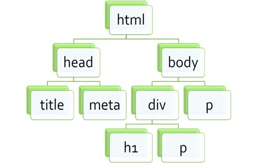

## 🦊 DOM이란?
> ***Document Object Model*** 의 약자로, 해석하자면 ***문서객체모델*** 이다.

모델은 대충 감이 오더라도 문서객체라는 말이 생소할 것이다.
#### 📍 문서객체란?
> `<html>`이나 `<body>` 같은 html문서의 태그들을 JavaScript가 이용할 수 있는 **객체**로 만들면 그것을 ***문서 객체*** 라고 한다.

그리고 여기에 Model을 붙였는데, Models이라는 영어 단어에는 모형, 주형이라는 의미도 있고 모듈이라는 의미도 있다. 
비슷하게 여기서는 문서 객체를 **인식하는 방식**이라고 해석할 수 있다.

#### 📍 다시, DOM이란?
DOM은 넓은 의미로 웹 브라우저가 HTML 페이지를 인식하는 방식을 의미한다.
좀 더 정확히 말하면 document 객체와 관련된 객체의 집합을 의미한다는 말이다.

이제 DOM을 보게 되면 웹 브라우저가 html 페이지를 인식하는 방식을 이야기 하거나,
문서 객체(document object)와 관련된 객체의 집합에 관한 이야기 라는 것을 쉽게 추측할 수 있다.

    

    트리 구조로 형성되어 있는 DOM

DOM을 제대로 이해하기 위해서는 tree라는 자료구조를 이해할 필요가 있다.
DOM이 tree 형식의 자료구조를 가지고 있기 때문이다.

tree의 자료구조를 간단히 설명하자면,
이름에서 알 수 있는 것처럼 하나의 root node에서 시작된다.

그런데 나무는 땅에서 솟아서 점점 위로 뻗어나가지만 tree형 나무구조는 흔히 위의 root node에서 아래로 퍼져나가는 형태를 그린다.

tree에서는 위쪽의 node를 부모(parent) 노드 아랫쪽 노드를 자식(child)라고 한다.
root node는 가장 위에서 시작되는 node니까 parent가 없는 node가 된다.
그리고 children(자식)이 없는 node를 leaf node라고 한다.

뿌리(root)에서 시작해서 잎(leaf)으로 끝난다는 말이다.

> node라는 말이 자꾸 나오는데, 
글을 읽으면서 대충은 이해했겠지만 그래도 정확하게 짚고 넘어가자 
🙋🏻‍♂️[node가 뭐에요?](./node/node.md)

## 🦊 더 나아가서...
[DOM은 어떻게 사용할까?](./use_DOM/use_DOM.md)
