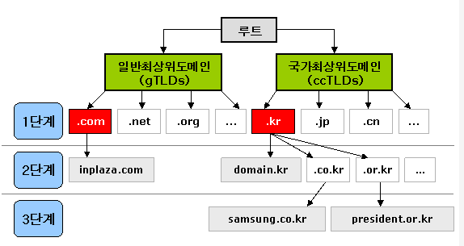
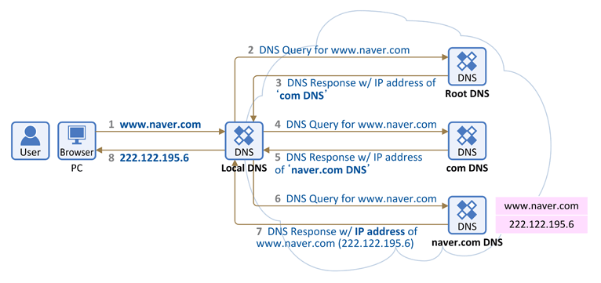

## 🧐 DNS 란?
- DNS란 **D**omain **N**ame **S**ystem의 약어로,<br>
사람이 읽을 수있는 도메인 네임 (예 : `www.naver.com`)을 기계가 읽을 수 있는 IP주소 (예 : `192.0.2.44`)로 변환시켜주는 시스템을 의미한다.<br>
## ✅ DNS 기본 사항
- 스마트폰이나 노트북부터 대규모 소매 웹 사이트의 콘텐츠를 서비스하는 서버에 이르기까지 인터넷상의 모든 컴퓨터는 숫자를 사용하여 서로를 찾고 통신한다. 이러한 숫자를 **IP 주소**라고 한다.
- 웹 브라우저를 열고 웹 사이트로 이동할 때는 긴 숫자를 기억해 입력할 필요가 없다.<br> 그 대신 `example.com`과 같은 도메인 이름을 입력해도 원하는 웹 사이트로 갈 수 있습니다.
- Amazon Route 53과 같은 DNS 서비스는 전 세계에 배포된 서비스로서, `www.example.com`과 같이 사람이 읽을 수 있는 이름을 `192.0.2.1`과 같은 숫자 IP 주소로 변환하여 컴퓨터가 서로 통신할 수 있도록 한다.
-  인터넷의 DNS 시스템은 이름과 숫자 간의 매핑을 관리하여 마치 전화번호부와 같은 기능을 한다.
-  DNS 서버는 이름에 대한 요청을 IP 주소로 변환하여 최종 사용자가 도메인 이름을 웹 브라우저에 입력할 때 해당 사용자를 어떤 서버에 연결할 것인지를 제어한다. 이 요청을 **쿼리**라고 부른다.<br>
## 🎰 DNS 서비스 유형
**1️⃣ 신뢰할 수 있는 DNS**
* 개발자가 퍼블릭 DNS 이름을 관리하는 데 사용하는 업데이트 메커니즘을 제공한다.
* 이를 통해 DNS 쿼리에 응답하여 도메인 이름을 IP 주소로 변환한다.
* 신뢰할 수 있는 DNS는 도메인에 대해 최종 권한이 있다.
* 재귀적 DNS 서버에 IP 주소 정보가 담긴 답을 제공할 책임이 있다.

**2️⃣ 재귀적 DNS**
* 보통 클라이언트는 신뢰할 수 있는 DNS 서비스에 직접 쿼리를 수행하지 않는다.
* 해석기 또는 재귀적 DNS 서비스라고 알려진 다른 유형의 DNS 서비스에 연결하는 경우가 일반적이다.
* 재귀적 DNS 서비스 는 호텔 컨시어지와 같은 역할을 한다.
* DNS 레코드를 소유하고 있지 않지만 사용자를 대신해서 DNS 정보를 가져올 수 있는 중간자의 역할을 한다.
* 일정 기간 동안 캐시된 또는 저장된 DNS 레퍼런스를 가지고 있는 경우, 소스 또는 IP 정보를 제공하여 DNS 쿼리에 답을 하거나, 해당 정보를 찾기 위해 쿼리를 하나 이상의 신뢰할 수 있는 DNS 서버에 전달한다.<br>


## 🎋 Domain 구조
<div align="center">
    
</div>

- 인터넷상에서 사용되는 도메인은 전 세계적을 고유하게 존재하는 이름으로 해야함
- 정해진 규칙 및 체계에 따라야 하며, 임의로 변경되거나 생성될 수 없음
- 인터넷상의 모든 도메인은 **.(dot)** 또는 **루트(root)** 라 불리는 도메인 아래에 그림과 같이 나무를 거꾸로 위치시킨 역트리(Inverted tree)구조로 계층적으로 구성되어 있음
- 루트 도메인 바로 아래의 단계를 1단계 도메인 또는 **최상위도메인(TLD, Top Level Domain)** 이라고 부르며, 그 다음 단계를 **2단계 도메인(SLD, Second Level Domain)** 이라고 함
- 도메인은 **일반최상위도메인(gTLD: Generic Top Level Domain)** 과 **국가최상위도메인(ccTLD: Country Code Top Level Domain)** 로 구분할 수 있으며 여기서 일반최상위도메인은 다시 스폰서도메인(Sponsored TLD)과 언스폰서도메인(Unsponsored TLD)으로 구분됩니다.<br>

# 🧨 DNS 동작 원리
<div align="center">
    
</div>

1. 위의 그림과 같이 PC 브라우저에서 www.naver.com 을 입력한다. 그러면 PC는 미리 설정되어 있는 DNS (단말에 설정되어 있는 이 DNS를 Local DNS라 부름, 위에서는 203.248.252.2) 에게 "www.naver.com 이라는 hostname" 에 대한 IP 주소를 요청한다.

2. Local DNS 에는 "www.naver.com 의 IP 주소"가 있을 수도 없을 수도 있다. 만약 있다면 Local DNS 가 바로 PC에 IP 주소를 주고 끝난다. 하지만 본 설명에서는 Local DNS에 "www.naver.com 의 IP 주소"가 없다고 가정 한다.

3. Local DNS는 이제 "www.naver.com 의 IP 주소"를 찾아내기 위해 다른 DNS 서버들과 통신(DNS 메시지)을 시작한다. 먼저 Root DNS 서버에게 "www.naver.com 의 IP 주소"를 요청하며, 이를 위해 각 Local DNS 서버에는 Root DNS 서버의 정보 (IP 주소)가 미리 설정되어 있어야 한다. Root DNS 서버 는 전세계에 13대가 구축되어 있다. 미국에 10대, 일본/네덜란드/노르웨이에 각 1대씩이며, 우리나라의 경우 Root DNS 서버가 존재하지는 않지만 Root DNS 서버에 대한 미러 서버를 3대 운용하고 있다고 한다.

4. Root DNS 서버 는 "www.naver.com 의 IP 주소" 를 찾을 수 없어 Local DNS 서버에게 "www.naver.com 의 IP 주소 찾을 수 없음. 다른 DNS 서버에게 물어봐" 라고 응답을 한다.

5. 이 다른 DNS 서버는 com 도메인 을 관리하는 DNS 서버이다.

6. 이제 Local DNS 서버는 com 도메인을 관리하는 DNS 서버에 다시 www.naver.com에 대한 IP 주소를 요청한다.

7. com 도메인을 관리하는 DNS 서버에도 해당 정보가 없으면, Local DNS 서버에게 "www.naver.com 의 IP 주소 찾을 수 없음. 다른 DNS 서버에게 물어봐" 라고 응답을 합니다. 이 다른 DNS 서버는 naver.com 도메인을 관리하는 DNS 서버 이다.

8. 이제 Local DNS 서버는 naver.com DNS 서버에게 다시 "www.naver.com 의 IP 주소" 를 요청한다.

9. naver.com DNS 서버 에는 "www.naver.com 의 IP 주소" 가 있다. 그래서 Local DNS 서버에게 "www.naver.com에 대한 IP 주소는 222.122.195.6" 라는 응답을 한다.

10. 이를 수신한 Local DNS는 www.naver.com 의 IP 주소를 캐싱을 하고 이후 다른 요청이 있을시 응답할 수 있도록 IP 주소 정보를 단말(PC)에 전달해 줍니다.

 

> Recursive Query : Local DNS 서버가 여러 DNS 서버를 차례대로<br> ```(Root DNS 서버 -> com DNS 서버 -> naver.com DNS 서버)```<br> 질의해서 답을 찾아가는 과정
