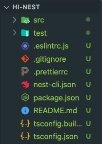
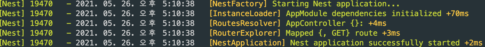

# 🐱 NestJS
<div align="center">
    
</div>

* node.js의 framework로, express 기반으로 제작되었으며, node.js에 백엔드를 구성할 수 있도록 해준다.
<br>

* 기본적으로 [typescript](https://github.com/songyouhyun/External-Brain/blob/master/Language/TypeScript/typescript.md)를 지원하며, javascript로 어플리케이션을 작성하는 것도 가능하다.
<br>

* 새로 추가된 문법인 `'@'`**[데코레이터](https://github.com/songyouhyun/External-Brain/blob/master/ETC/ETC.md#%EB%8D%B0%EC%BD%94%EB%A0%88%EC%9D%B4%ED%84%B0decorator%EB%9E%80)**(Decorator)를 아주아주 많이 이용한다.
<br>

* NestJS는 **구조**라는 것을 갖고 있고, 그 구조 덕분에 순서와 룰도 있어서 이를 따르기만 하면 큰 규모의 백엔드를 쉽게 만들 수 있다.(미리 셋팅된 여러 기능들을 제공하기 때문에 수동으로 생성하지 않아도 된다.) `Spring 프레임워크🍃와 비슷한 구조를 가졌어요!`
<br>

* node.js 어플리케이션을 빌드하는데 유용하며, **객체지향 프로그래밍**(Object Oriented Programming)과 **함수형 프로그래밍**(Functional Programming), **함수 반응형 프로그래밍**(Functional Reactive Programming)의 요소도 일부분 사용한다.


## 📚 Nest의 구조
<div align="center">
    
</div>

위 사진은 Nest를 generate 시켰을 때 생성되는 파일들이다. 하나씩 살펴보도록 하자

* **dist** - 타입스크립트가 자바스크립트로 컴파일되어 저장되는 폴더
* **node_moduels** - Node.js의 모듈이 설치되는 폴더
* **src** - 리소스 폴더
* **test** - [e2e test](https://github.com/songyouhyun/External-Brain/blob/master/ETC/ETC.md#e2e-testend-to-end-test%EB%9E%80)를 위해서 만들어진 폴더
* **.eslintrc.js** - 코드에 특정 스타일과 규칙을 적용해서 문제를 사전에 찾고 패턴을 적용시킬 수 있는 정적 분석 툴
* **.gitignore** - Git 버전 관리에서 제외할 파일 목록을 지정하는 파일
* **Prettierrc** - 코드를 읽어들여서 사용자 옵션에 따라 코드를 다시 포맷팅하는 코드 포맷터

### 📁 src
우리는 그 중에서도 핵심파일인 `src/`디렉토리를 좀 더 자세히 살펴보도록 하자.
<br>

```bash
├── src
│   ├── app.controller.spec.ts
│   ├── app.controller.ts
│   ├── app.module.ts
│   ├── app.service.ts
│   └── main.ts
```

* **XXX.controller.ts** : 간단한 경로가있는 기본 컨트롤러.<br>
Nestjs는 기본적으로 컨트롤러(Controller)를 통해 **라우팅**(Routing)을 구현한다.
<br>

* **XXX.service.ts** : 컨트롤러를 통해 작동되어야 하는 서비스 코드가 작성된 파일.<br>
DB 처리 진행(화면에 표시되는 Hello World가 있는 부분)
<br>

* **XXX.module.ts** : 어플리케이션 루트 모듈, 모듈 연결자 라고 생각.<br>
imports, controllers, service 등의 루트 연결 담당
`최상위라면 밑으로 자식모듈들을 import 가능하다고 생각 할 수 있겠네요 😮`
<br>

* **main.ts** (파일명 변경 불가) : 핵심 기능 NestFactory을 사용하여 Nest 애플리케이션 인스턴스를 생성하는 애플리케이션의 항목 파일. 가장 기본이 되는 파일로, 서버포트를 열어 주는 역할을 한다.

## 💨 코드 흐름
**`service`** 👉 **`controller`** 👉 **`module`** 👉 **`main.ts`**

service에서 작성한 코드를 controller에서 사용하고,<br>
controller와 service에서 작성한 코드를 module에서 사용하고,<br>
module에서 작성한 코드를 main.ts에서 사용한다.<br>

## 🤖 프로젝트 실행하기
<div align="center">
    
</div>

프로젝트를 실행하면 teminal에 로그메세지가 뜨면서 어플리케이션이 실행되는 것을 확인 할 수 있습니다.


    1. Nest Application을 시작합니다.
    2. InstanceLodder는 각각의 Module에 대해 Controller, Injectable, Provider를 초기화 해줍니다.
    3. RouteResolver는 Controller의 path 정보를 추출해서 생성자로 주입받은 routerExplorerroute의 explore Method를 통해서 path에 대해서 Mapping 해줍니다.
