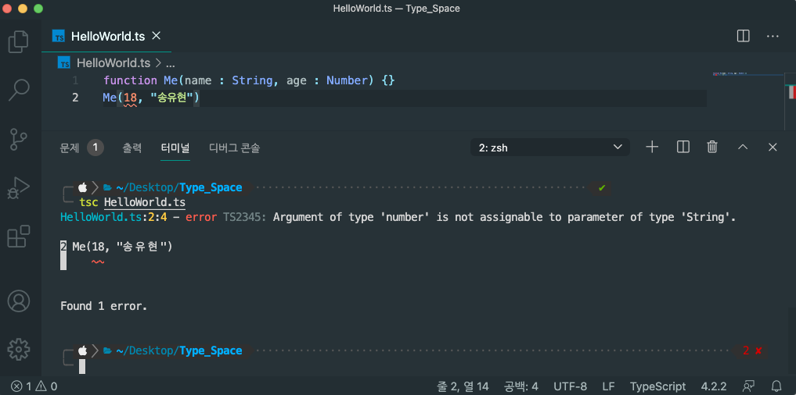

# 타입스크립트란 무엇인가?
<div align="center">
    
</div>

## 🐣 세 종류의 자바스크립트
자바스크립트는 현재 세 가지 종류가 있습니다. 웹 브라우저에서 동작하는 표준 자바스크립트인 ES5(ECMAScript 5)와 2015년부터 매년 새로운 버전을 발표하는 ESNext, 그리고 ESNext에 타입(type)기능을 추가한 **타입스크립트**(TypeScript)입니다.


<br>`ES5와 ESNext, 타입스크립트의 관계도`

ESNext는 ES5의 모든 문법을 포함하고, 타입스크립트는 EXNext의 모든 문법을 포합합니다. 따라서 타입스크립트로 개발했더라도 타입 기능을 사용하지 않는다면 ESNext 소스나 마찬가지입니다.

## 👨🏻‍💻 ESNext 자바스크립트란?
자바스크립트의 공식 표준은 ECMAScript(줄여서 ES)입니다. 2009년 발표된 ES5 버전이 있었는데 2015년에 발표된 ES6 버전에서 큰 변화가 있었습니다. 그래서 ES6 이후 버전을 통틀어 가리킬 때는 '**새로운 자바스크립트**'라는 뜻에서 '**ESNext**'라고 합니다.<br>
<br>

그리고 2015년에 ECMAScript 공식 버전 표기법이 바뀌었습니다. ES6부터는 발표 연도를 붙여 '**ECMAScript2015**'(줄여서 ES2015)처럼 부르기로 했습니다. 또한, 1년 주기로 새로운 버전을 발표하기로 해서 2021년 현재 ECMAScript 2021까지 나왔습니다.

## 🎯 자바스크립트의 타입 기능이 있으면 좋은 이유
```javascript
function Me(name, age) {}
Me(18,"송유현")
```
위 코드를 잘 살펴봅시다.<br>
만약 위 코드에서 에러가 발생한다면 우리는 오류의 원인이 무엇인지 찾기가 어렵습니다.

```typescript
function Me(name: String, age: Number) {}
```
하지만 처음 코드를 위처럼 타입스크립의 타입 기능을 이용해 구현했다면 이러한 문제는 발생하지 않았을 것입니다.

<br>
심지어 타입스크립트 컴파일러는 문제의 원인이 어디에 있는지 친절하게 알려주므로 코드를 좀 더 수월하게 작성할 수 있습니다.

이 때문에 개발자들은 대규모 소프트웨어를 개발할 때 자바스크립트보다 타입스크립트를 선호하게 되었습니다.

## ⚠️경고!
타입스크립트는 기본적으로 ESNext 자바스크립트 문법을 포함하고 있지만, 자바스크립트와는 완전히 다른 언어입니다.<br>
예를 들자면 이렇습니다.
```javascript
a => a + 1
```
자바스크립트 컴파일러는 위와 같은 코드를 동작시킬 수 있습니다.<br>
하지만 타입스크립트는 그렇지 않습니다.<br>
타입스크립트의 컴파일러는 타입이 명시적으로 설정되어 있어야만 코드가 문법에 맞게 작성되었는지를 검증해 코드를 동작시킵니다.
```typescript
(a:number): number => a + 1
```

이 때문에 자바스크립트로 개발된 chance, ramda와 같은 라이브러리들은 추가로 **`@types/chance`** **`@types/ramda`** 와 같은 타입 라이브러리들을 제공해야 합니다.<br>
<br>

`@types/`가 앞에 붙는 타입 라이브러리들은 항상 **index.d.ts**라는 이름의 파일을 가지고 있으며, 타입스크립트 컴파일러는 이 파일의 내용을 바탕으로 ***chance, ramda***와 같은 라이브러리가 제공하는 함수들을 올바르게 사용했는지 검증합니다.<br>
<br>

타입스크립트는 또한 웹 브라우저나 Node.js가 기본으로 제공하는 타입들의 존재도 그냥은 알지 못합니다.<br>
예를 들어, Promise와 같은 타입을 사용하려면 **`@types/node`** 라는 패키지를 설치해야 합니다.
