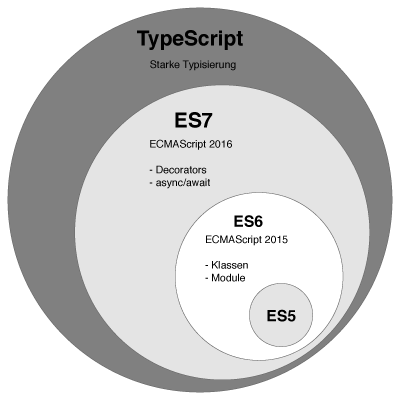

# 타입스크립트란 무엇인가?

    

## 🐣 세 종류의 자바스크립트
자바스크립트는 현재 세 가지 종류가 있습니다. 웹 브라우저에서 동작하는 표준 자바스크립트인 ES5(ECMAScript 5)와 2015년부터 매년 새로운 버전을 발표하는 [ESNext](), 그리고 ESNext에 타입(type)기능을 추가한 **타입스크립트**(TypeScript)입니다.

 `ES5와 ESNext, 타입스크립트의 관계도`

ESNext는 ES5의 모든 문법을 포함하고, 타입스크립트는 EXNext의 모든 문법을 포합합니다. 따라서 타입스크립트로 개발했더라도 타입 기능을 사용하지 않는다면 ESNext 소스나 마찬가지입니다.

## 👨🏻‍💻 ESNext 자바스크립트란?
자바스크립트의 공식 표준은 ECMAScript(줄여서 ES)입니다. 2009년 발표된 ES5 버전이 있었는데 2015년에 발표된 ES6 버전에서 큰 변화가 있었습니다. 그래서 ES6 이후 버전을 통틀어 가리킬 때는 '**새로운 자바스크립트**'라는 뜻에서 '**ESNext**'라고 합니다.

그리고 2015년에 ECMAScript 공식 버전 표기법이 바뀌었습니다. ES6부터는 발표 연도를 붙여 