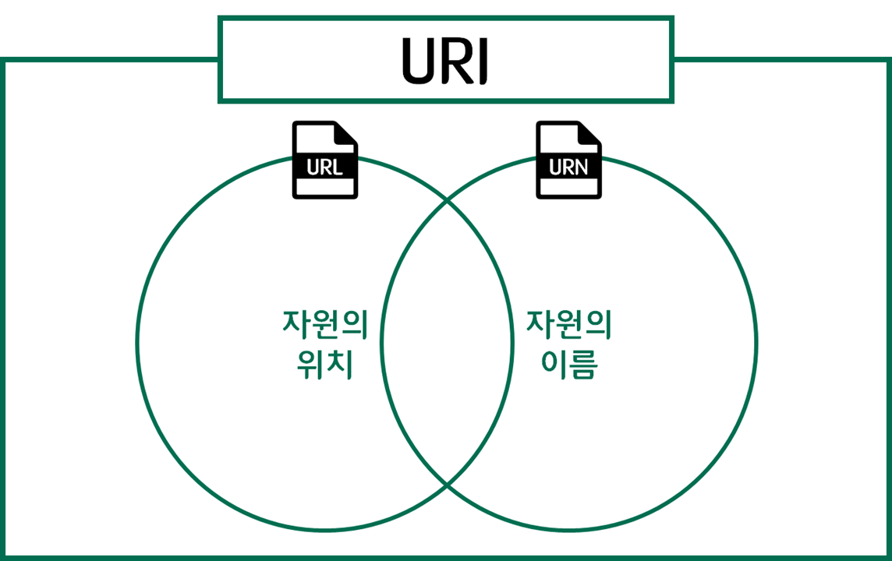

# URI & URL & URN

### 🎯 URI이란?
> ***Uniform Resource Identifier***의 약자이다.
* 네트워크 상에 존재하는 자원의 위치를 알려주기 위한 규약이다.(자원 식별자)
* 인터넷에 있는 자원을 나타내는 유일한 주소이다.
* URI의 존재는 인터넷에서 요구되는 기본조건으로서 인터넷 프로토콜에 항상 붙어 다닌다.
* URI의 하위개념으로 URL, URN 이 있다.

### 🎯 URL이란?
> ***Uniform Resource Locator***의 약자이다.
* 네트워크 상에서 자원이 어디 있는지를 알려주기 위한 규약이다.
* 컴퓨터 네트워크와 검색 메커니즘에서의 위치를 지정하는, 웹 리소스에 대한 참조이다.
* 흔히 웹 사이트 주소로 알고 있지만, URL은 웹 사이트 주소뿐만 아니라 컴퓨터 네트워크상의 자원을 모두 나타낼 수 있다.
* 주소에 접속하려면 해당 URL에 맞는 프로토콜을 알아야 하고, 그와 동일한 프로토콜로 접속해야 한다.

### 🎯 URN이란?
> ***Unfiorm Resource Name***의 약자이다.
* urn:scheme 을 사용하는 URI를 위한 역사적인 이름이다.
* URN은 영속적이고, 위치에 독립적인 자원을 위한 지시자로 사용하기 위해 1997년도 RFC 2141 문서에서 정의되었다.

### 🎯 URI과 URL 구분
URL이란건 URI의 하위개념이다. 

`http://www.naver.com/?id='송유현'`의 경우 `http://www.naver.com`까지가 **URL**이다.
> 내가 원하는 정보에 도달하기 위해서는 ?id='송유현' 이라는 **식별자**가 필요하기 때문
> (자원을 식별하는 것은 URI의 영역)
 

URI는 규약이고, URL은 규약에 대한 형태라고 생각하면 된다.
