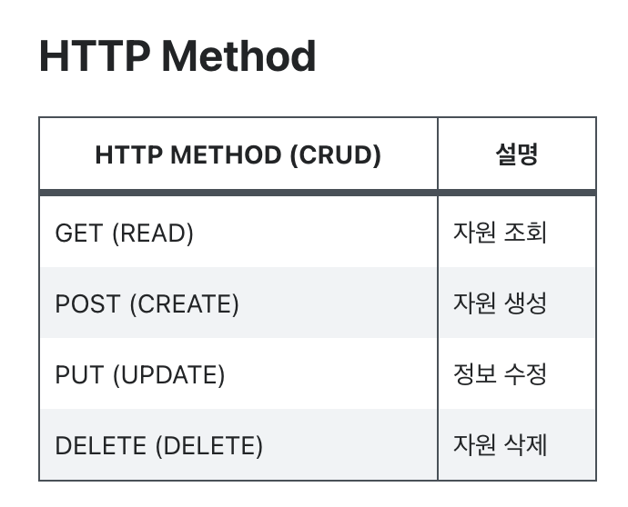

# RSET API가 뭐에요?

    

## 🌈 REST
### 📍 REST의 정의
> *Representational State Transfer*의 약자로, 
***자원을 이름으로 구분하여 해당 자원의 상태를 주고 받는 모든 것*** 을 의미한다.

 

여기서 **자원**은 해당 소프트웨어가 관리하는 모든 것을 의미하며, 
뭐 예를 들면 DB 안에 들어가 있는 데이터 하나하나, 이미지 하나하나 등을 의미할 수 있겠다.  
그리고 **자원의 상태**를 주고 받을 때, HTTP 프로토콜을 이용하니 우리(클라이언트)가 웹을 이용하며 자원을 **요청**(Request)하면 서버(Server)에서 자원을 **전달**(Response)해준다. 
`보통 JSON 형태나 XML 형태를 이용하여 자원의 상태를 전달하게 된다.`
  
그리고 자원들을 주고 받을 때, 아래 4가지 방법을 기본으로 하여 자원들을 주고받는다. 

    

 

### 📍 REST 구성
> * 자원 (Resource) - URL
> * 행위 (Verb) - Http method
> * 표현 (Representations)

 

### 📍 REST의 특징
API가 REST의 조건에 충족하게 되면 REST한 API, 즉 REST API가 되게 된다. 
API가 RESTful로 간주되려면 다음 기준을 따라야 합니다. 

1. ***Server-Client***(서버-클라이언트 구조)
    * 자원이 있는 쪽이 Server, 자원을 요청하는 쪽이 Client가 된다.
        * REST Server: API를 제공하고 비즈니스 로직 처리 및 저장을 책임진다.
        * Client: 사용자 인증이나 context(세션, 로그인 정보) 등을 직접 관리하고 책임진다.
    * 서로 간 의존성이 줄어든다.
 

2. ***Stateless***(무상태)
    * HTTP 프로토콜은 Stateless Protocol이므로, REST 역시 무상태성을 갖는다.
    * Client의 context를 Server에 저장하지 않는다.
        * 즉, 세션과 쿠키와 같은 context 정보를 신경쓰지 않아도 되므로 구현이 단순해진다.
    * Server는 각각의 요청을 완전히 별개의 것으로 인식하고 처리한다.
        * 각 API 서버는 Client의 요청만을 단순 처리한다.
        * 이전 요청이 다음 요청의 처리에 연관되어서는 안된다.
        * 이전 요청이 DB를 수정하여 DB에 의해 바뀌는 것은 허용한다.
        * Server의 처리 방식에 일관성을 부여하고 부담이 줄어들며, 서비스의 자유도가 높아진다.
 

3. ***Cacheable***(캐시 처리 가능)
    * 웹 표준 HTTP 프로토콜을 그대로 사용하므로 웹에서 사용하는 기존의 [인프라](https://github.com/songyouhyun/TIL/blob/master/ETC/ETC.md#%EC%9D%B8%ED%94%84%EB%9D%BC%EB%9E%80infrastructure)를 그대로 활용할 수 있다.
        * HTTP가 가진 가장 강력한 특징 중 하나인 캐싱 기능을 적용할 수 있다.
        * HTTP 프로토콜 표준에서 사용하는 Last-Modified 태그나 E-Tag를 이용하면 캐싱 구현이 가능하다.
    * 대량의 요청을 효율적으로 처리하기 위해 캐시가 요구된다.
    * 캐시 사용을 통해 응답시간이 빨라지고 REST Server 트랜잭션이 발생하지 않기 때문에 전체 응답시간, 성능, 서버의 자원 이용률을 향상시킬 수 있다.
 

4. ***Layered System***(계층화)
    * Client는 REST API Server만 호출한다.
    * REST Server는 다중 계층으로 구성될 수 있다.
        * API Server는 순수 비즈니스 로직을 수행하고 그 앞단에 보안, 로드밸런싱, 암호화, 사용자 인증 등을 추가하여 구조상의 유연성을 줄 수 있다.
        * 또한 로드밸런싱, 공유 캐시 등을 통해 확장성과 보안성을 향상시킬 수 있다.
    * PROXY, 게이트웨이 같은 네트워크 기반의 중간 매체를 사용할 수 있다.
 

5. ***Code-On-Demand***(optional)
    * Server로부터 스크립트를 받아서 Client에서 실행한다.
    * 반드시 충족할 필요는 없다.
 

6. ***Uniform Interface***(인터페이스 일관성)
    * URI로 지정한 Resource에 대한 조작을 통일되고 한정적인 인터페이스로 수행한다.
    * HTTP 표준 프로토콜에 따르는 모든 플랫폼에서 사용이 가능하다.
        * 특정 언어나 기술에 종속되지 않는다.
 

## 🌈 REST API
> ***RESTful한 API***, 즉 **REST 기반으로 서비스 [API](https://github.com/songyouhyun/TIL/blob/master/ETC/ETC.md#apiapplication-programming-interface%EB%9E%80)를 구현한 것**

최근 [OpenAPI](https://github.com/songyouhyun/TIL/blob/master/ETC/ETC.md#openapi%EB%9E%80), [마이크로 서비스](https://github.com/songyouhyun/TIL/blob/master/ETC/ETC.md#마이크로-서비스란) 등을 제공하는 업체 대부분은 REST API를 제공한다.

### 📍 REST API 설계 기본 규칙
> * 도큐먼트 : 객체 인스턴스나 데이터베이스 레코드와 유사한 개념
> * 컬렉션 : 서버에서 관리하는 디렉터리라는 리소스
> * 스토어 : 클라이언트에서 관리하는 리소스 저장소

 

1. URL은 정보의 자원을 표현해야 한다.
    * resource는 동사보다는 명사를, 대문자보다는 소문자를 사용한다.
    * resource의 도큐먼트 이름으로는 단수 명사를 사용해야 한다.
    * resource의 컬렉션 이름으로는 복수 명사를 사용해야 한다.
    * resource의 스토어 이름으로는 복수 명사를 사용해야 한다. 
    e.g.) `GET /Member/1` 👉 `GET /members/1`
 

2. 자원에 대한 행위는 **HTTP Method**(GET, POST, PUT, DELETE)로 표현한다.
    * URI에 HTTP Method가 들어가면 안된다. 
    e.g.) `GET /members/delete/1` 👉 `DELETE /members/1`
     
    
    * URI에 행위에 대한 동사 표현이 들어가면 안된다.(즉, CRUD 기능을 나타내는 것은 URI에 사용하지 않는다.) 
    e.g.) `GET /members/show/1` 👉 `GET /members/1` 
    e.g.) `GET /members/insert/2` 👉 `POST /members/2`
     
    
    * 경로 부분 중 변하는 부분은 유일한 값으로 대체한다.(즉, :id는 하나의 특정 resource를 나타내는 고유값이다.) 
    e.g.) student를 생성하는 route: `POST /students` 
    e.g.) id=12인 student를 삭제하는 route: `DELETE /students/12`
     
 

### 📍 REST API 설계 중심 규칙
1. **슬래시 구분자(/ )는 계층 관계를 나타내는데 사용한다.** 
    e.g.) `http://restapi.example.com/houses/apartments`
 

2. **URI 마지막 문자로 슬래시(/ )를 포함하지 않는다.**
    * URI에 포함되는 모든 글자는 리소스의 유일한 식별자로 사용되어야 하며 URI가 다르다는 것은 리소스가 다르다는 것이고, 역으로 리소스가 다르면 URI도 달라져야 한다.
    * REST API는 분명한 URI를 만들어 통신을 해야 하기 때문에 혼동을 주지 않도록 URI 경로의 마지막에는 슬래시(/)를 사용하지 않는다. 
    e.g.) `http://restapi.example.com/houses/apartments/` (X)
 

3. **하이픈( - )은 URI 가독성을 높이는데 사용**
    * 불가피하게 긴 URI경로를 사용하게 된다면 하이픈을 사용해 가독성을 높인다.
 

4. **밑줄( _ )은 URI에 사용하지 않는다.**
    * 밑줄은 보기 어렵거나 밑줄 때문에 문자가 가려지기도 하므로 가독성을 위해 밑줄은 사용하지 않는다.
 

5. **URI 경로에는 소문자가 적합하다.**
    * URI 경로에 대문자 사용은 피하도록 한다.
    * RFC 3986(URI 문법 형식)은 URI 스키마와 호스트를 제외하고는 대소문자를 구별하도록 규정하기 때문
 

6. **파일확장자는 URI에 포함하지 않는다.**
    * REST API에서는 메시지 바디 내용의 포맷을 나타내기 위한 파일 확장자를 URI 안에 포함시키지 않는다.
    * Accept header를 사용한다. 
    e.g.) `http://restapi.example.com/members/soccer/345/photo.jpg` (X) 
    e.g.) `GET / members/soccer/345/photo HTTP/1.1 Host: restapi.example.com Accept: image/jpg` (O)
 

7. **리소스 간에는 연관 관계가 있는 경우**
    * /리소스명/리소스 ID/관계가 있는 다른 리소스명 
    e.g.) `GET : /users/{userid}/devices` (일반적으로 소유 ‘has’의 관계를 표현할 때)
 
