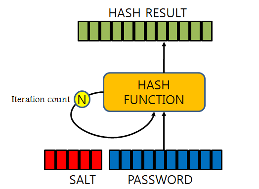
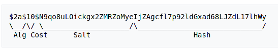

## 🔒 Bcrypt

> ***Bcrypt란?***
1999년에 Niels Provos와 David Mazieres가 발표한 가장 강력한 단방향 비밀번호 해시 매커니즘 중 하나이다. 
C, C++, C#, Go, Java, PHP, Perl, Python, Ruby등의 언어를 지원한다.

### 🧩  단방향 해시 함수
단방향 해시 함수는 수학적인 연산을 통해 원본 메세지를 변환하여 암호화된 메세지인 **digest**를 생성한다. 이 방식으로 암호화된 digest는 다시 평문으로 볼 수 없다.

하지만 위와같은 단방향 해시 알고리즘은 다음과 같은 문제점이 있다.

#### 📍 문제점
* **Rainbow Attack**
    동일한 메세지가 동일한 digest를 생성하는 경우. 즉, 똑같은 비밀번호가 똑같은 해시값을 생성하는 경우에 일어나는 문제점이다.  
    비밀번호별로 해당 digest(해시값)을 미리 저장한 테이블을 만들어 원본 비밀번호를 역추적하여 사용자의 비밀번호를 알아 낼 수 있다. 이와 같은 **digest 목록을 담고 있는 테이블**을 rainbow table이라고 하고 이 공격 방식을 **rainbow attack**이라고 한다.
      
    해쉬 함수는 원래 짧은 시간에 데이터를 검색하기 위해 설계되었다. 그렇기 때문에 해쉬 함수는 본래 처리속도가 최대한 빠르도록 설계되었고, 이러한 속성때문에 공격자는 매우 빠른 속도로 임의의 문자열의 다이제스트와 해킹할 대상의 다이제스트를 비교할 수 있다.

#### 📍 보완점
* **Salting**
    실제 정보 이외에 추가적으로 무작위 데이터를 더해서 해시 값을 계산하는 방법.   [salt](https://github.com/songyouhyun/TIL/blob/master/ETC/ETC.md#salt%EB%9E%80)로 인해 해시값이 달라지기 때문에, rainbow attack 같이 미리 해시 값을 계산해 하는 공격을 무효화 시킨다. [salt](https://github.com/songyouhyun/TIL/blob/master/ETC/ETC.md#salt%EB%9E%80) 자체는 비밀이 아니고 해시 값을 바꾸는데 목적이 있다. [salt](https://github.com/songyouhyun/TIL/blob/master/ETC/ETC.md#salt%EB%9E%80)는 비밀번호마다 모두 다르기 때문에 같은 비밀번호라도 해시값이 달라지게 된다. 이 때문에 공격자는 해시값 데이터베이스를 만들 수 없다.

    

        
    

* **키 스트레칭**
    기존 단방향 해시 알고리즘의 빠른 실행 속도가 취약점이 됐던것을 보완하기 위한 방법.   단방향 해시 값을 계산한 후 그 해시 값을 다시 해시하고, 이를 반복한다. 향후 컴퓨터 성능이 향상되어도 해시 반복 횟수를 추가하여 계속해서 보완할 수 있다.

---
### 🔗 Bcrypt
> **salting**과 **키 스트레칭**을 구현한 해시 함수 중 대표적인 함수
bcrypt는 처음부터 비밀번호 단방향 암호화를 하기 위해 만들어진 해쉬함수이다.

#### 📍 예시

    

`위 그림은 Bcrypt로 해시화 시킨 digest이다.`

*  **Algorithm** : 알고리즘 식별자. '$2a$'는bcrypt를 뜻한다 
*  **Cost factor** : 키 스트레칭한 횟수. 2^n으로 위의 경우 2^10=1024이다 
*  **Salt** : 128비트 솔트, 22자 base64로 인코딩 
*  **Hash** : salting과 키 스트레칭 후 해시 값 

#### 📍 bcrypt 검증 방법
비밀번호가 동일한지 검증하기 위해 입력된 비밀번호에 salting, 키 스트레칭을 해서 저장된 bcrypt 문자열과 비교한다.