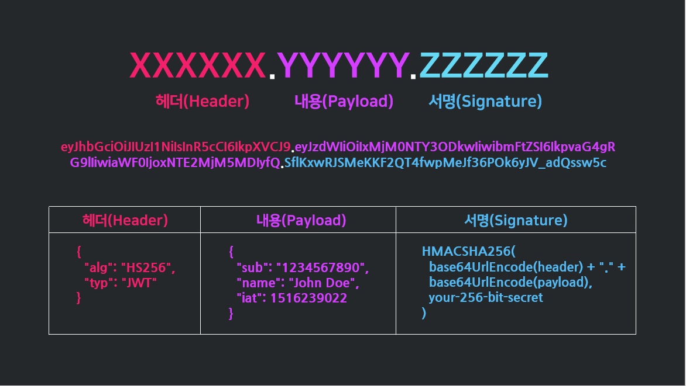

# 🗝 JWT

    

### 1️⃣ JWT 개념
> **Json Web Token**의 약자로,
> Json 포맷을 이용하여 사용자에 대한 속성을 저장하는 [Claim](../../ETC/ETC.md#claim이란) 기반의 Web Token이다.

일반적으로 클라이언트와 서버, 서비스와 서비스 사이 통신 시 권한 인가(Authorization)를 위해 사용하는 토큰을 뜻합니다.

 

### 2️⃣ JWT 등장배경
시작하기에 앞서, 인증 로직에 대해서 봐보도록 합시다.

    

 

사용자가 ID, PW를 입력하고, 그 데이터가 서버로 전송이 됩니다. 
서버에서는 전송받은 ID, PW를 **DB**에 조회하고 회원이면 로그인을 시켜줍니다.  

그런데 문제는 여기서 생기게됩니다. 
HTTP는 **Stateless**(무결성상태), 즉 사용자가 새로운 요청을 한다면 과거에 로그인한 사실을 기억하지 못합니다.  

이 문제를 해결하기 위해서 예전에는 로그인 할 때 DB에 누가 로그인했는지 기록해야 했습니다.  

그래서 나온게 [쿠키]()와 [세션]()이였는데, 쿠키와 세션에는 각각 문제점들이 있었습니다. 

그리고 이를 보완하기 위해서 토큰 기반의 인증방식을 사용하는 추세인데요. 
토큰 기반 인증방식의 로직은 이렇습니다.

    

 

로그인을 하면 로그인한 사용자를 위한 토큰을 발급합니다.  
사용자는 이 토큰을 가지고 물건 구입, 구입 내역 조회와 같이 계정 정보가 필요한 요청을 할 때 이 **토큰과 함께 요청**합니다. 
토큰에는 요청한 사람의 정보가 담겨있기에 서버는 DB를 조회하지 않고 누가 요청하는지 알 수 있고, 별도의 인증 서버가 필요 없게됩니다.  

그리고 토큰은 서버의 상태를 저장하지 않습니다. 
따라서 요청을 받을 서버 자체에서 인증 프로세스를 수행할 수 있게 되죠.  

또한, JSON 포맷으로 통신하기 때문에 어떤 Client에서든 Data 통신에 JSON을 이용하면 Token을 이용할 수 있습니다.

---
    애플리케이션이 실행될 때, JWT를 static 변수와 로컬 스토리지에 저장하게 된다.
    static 변수에 저장되는 이유는 HTTP 통신을 할 때마다 JWT를 HTTP 헤더에 담아서 보내야 하는데, 이를 로컬 스토리지에서 계속 불러오면 오버헤드가 발생하기 때문이다.

    클라이언트에서 JWT를 포함해 요청을 보내면 서버는 허가된 JWT인지를 검사한다.

    또한 로그아웃을 할 경우 로컬 스토리지에 저장된 JWT 데이터를 제거한다.
    (실제 서비스의 경우에는 로그아웃 시, 사용했던 토큰을 blacklist라는 DB 테이블에 넣어 해당 토큰의 접근을 막는 작업을 해주어야 한다.)

### 3️⃣ JWT 구조

    

> JWT는 ***Header, Payload, Signature***의 3 부분으로 이루어지며, Json 형태인 각 부분은 **Base64**로 [인코딩](../../ETC/ETC.md#인코딩이란) 되어 표현된다.

#### 📍 HEADER(헤더)
- **Header**는 두 가지 정보로 구성된다. **`alg=알고리즘, typ=타입`**
- 첫째는 **토큰의 유형**(JWT)을 나타내고, 두 번째는 HMAC, SHA256 또는 RSA와 같은 **해시 알고리즘**을 나타내는 부분이다.

#### 📍 PAYLOAD(내용)
- **Payload**에는 사용자 인증 관련 정보, 즉 토큰에 담을 [클레임(claim)](../../ETC/ETC.md#claim이란) 정보를 포함하고 있다.
- 수정이 가능하여 더 많은 정보를 추가해둘 수도 있다.

> ⚠️ ***주의!*** 이 곳은 노출과 수정이 가능한 지점이기에 **인증이 필요한 최소한의 정보**만 담아야한다

**인증에 필요한 최소한의 정보**란 아이디, 비밀번호, 개인정보 등이 아니라, 
이 토큰을 가졌을 때 권한의 범위, 토큰의 발급일과 만료일자 등을 의미한다.

#### 📍 Signature(서명)
> ❗️ **Signature 부분이 가장 중요한 역할을 한다**❗️
- **Signature**는 점(.)을 구분자로 해서 헤더와 페이로드를 합친 문자열을 서명한 값이다.
- 다른 사람이 위변조 했는지 검증하기 위한 부분이다.
- 헤더의 alg에 정의된 알고리즘과 비밀 키를 이용해 성성하고 Base64 URL-Safe로 인코딩한다.
- 헤더의 인코딩 값, 정보의 인코딩 값을 합친 후 비밀키로 해쉬를 하여 생성한다.

위변조 검증의 구체적인 사례를 들어보면 이렇다.

> 토큰 발급된 이후에 누군가 Payload 정보를 수정한다. 
> Payload는 조작된 정보가 들어가 있지만 **Signature에는 변경되기 전 Payload 내용을 기반으로 암호화된 결과**가 저장되어 있다.  
> **`조작 전 Payload를 암호화한 결과`** 와 **`조작 후 Payload를 암호화한 결과`** 는 다른 값이 나오게 된다. 
> 이러한 방식으로 비교하면 서버는 토큰 조작 여부를 쉽게 알 수 있다.
