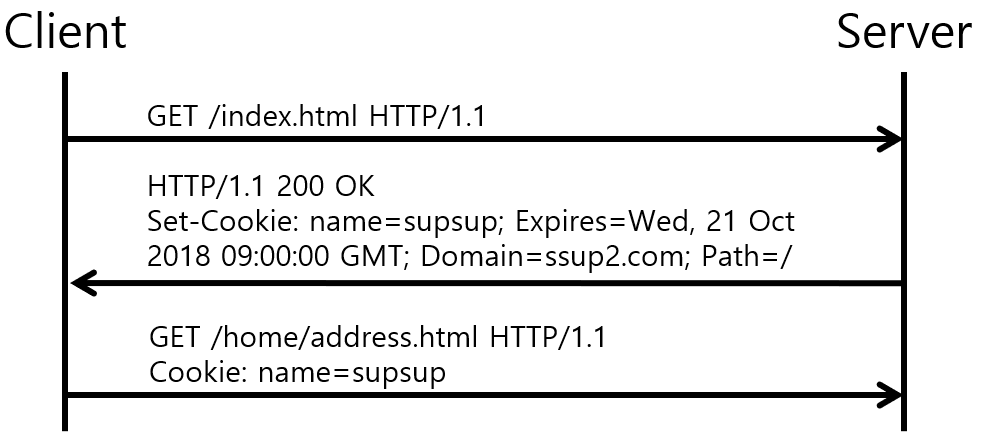
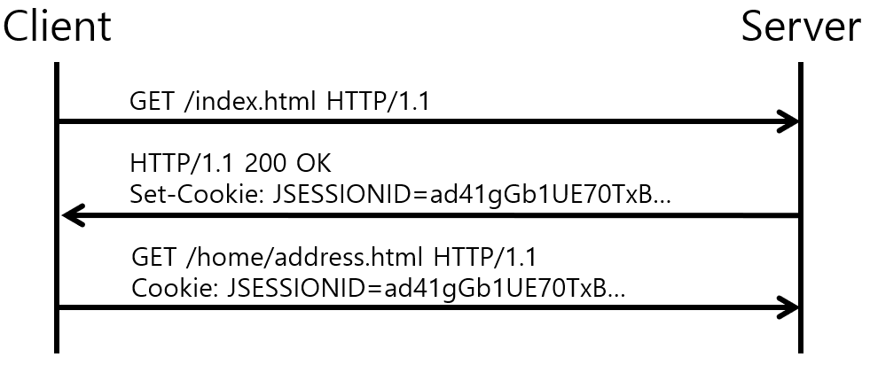

# 쿠키🍪(Cookie)와 세션🗃(Session)
쿠키와 세션은 HTTP의 특징인 **Stateless**(무상태), 즉 상태를 기억하지 못하는 클라이언트 때문에 상태를 기억하기 위해 나왔습니다.  
상태를 기억하지 못하여 정보가 유지되지 않게되면 매번 페이지를 이동할 때마다 로그인을 다시 하거나, 
상품을 선택했는데 구매 페이지에서 선택한 상품의 정보가 없거나 하는 등의 일이 발생할 수 있죠.
## 쿠키란❓
> **서버가 클라이언트(브라우저)의 로컬에 보내어 서버의 부가적인 요청이 있을 때, 다시 서버로 보내주는 문자열 정보입니다.**

 

## 🔎 쿠키 구성 요소
* **이름**(Key) : 각각의 쿠키를 구별하는 데 사용되는 이름
* **값**(Value) : 쿠키가 갖고 있는 값
* **유효시간** : 쿠키의 유지시간
* **도메인** : 쿠키를 전송할 도메인
* **경로** : 쿠키를 전송할 요청 경로

## 🍭 쿠키 동작 원리

    

1. 클라이언트가 페이지를 **요청**한다.(사용자가 웹페이지에 접근)
2. 웹 서버는 쿠키를 생성한다.
3. HTTP header에 쿠키를 넣어 **응답**한다.
4. 넘겨받은 쿠키는 클라이언트가 가지고 있다가 로컬 pc에 저장 
(다시 서버에 요청할 때 요청과 함께 쿠키를 전송한다.)
5. 브라우저가 종료되어도 **쿠키 만료 기간**이 남아 있다면 클라이언트에서 보관 
(쿠키 만료 기간은 옵션을 통해 설정할 수 있습니다.)
6. 동일 사이트 재방문시 클라이언트의 PC에 해당 쿠키가 있는 경우, 요청 페이지와 함께 쿠키를 전송한다.
 

## 🕶 쿠키의 특징
 

* 데이터 형태는 Key,Value형태로 String 문이며, 4KB이상 저장이 불가합니다.
* 브라우저마다 저장되는 쿠키는 다릅니다. 서버에서는 브라우저가 다르면 **다른 사용자**로 인식합니다. 
`(크롬으로 남긴 쿠키는 인터넷 익스플로어에서 사용할 수 없습니다.)`
* 쿠키는 서버를 대신해서 이러한 정보들을 웹 브라우저에 저장해줍니다. 그리고 사용자가 요청을 할 때 그 정보를 함께 보내서 서버가 사용자를 식별할 수 있게 해줍니다.
* 브라우저에 저장되기때문에 임의로 고치거나 지울 수 있고, 가로채기도 쉬워 보안이 취약합니다.
 

---
## 세션이란❓
> **일정 시간동안 같은 클라이언트(정확하게 브라우저를 말한다)로 부터 들어오는
일련의 요구를 하나의 상태로 보고 그 상태를 일정하게 유지시키는 기술**입니다.
 

또한 여기서 일정 시간이란 클라이언트가 웹 브라우저를 통해 웹 서버에 접속한 시점으로부터 웹 브라우저를 종료함으로써 연결을 끝내는 시점을 말하며 
즉, 클라이언트가 웹서버에 접속해 있는 상태를 하나의 단위로 보고 **세션**이라고 칭한다는 것이죠. 

이 세션이라는 것도 쿠키를 기반으로 나온 것으로,
쿠키에 세션아이디를 실어서 응답할 때 함께 전달됩니다.
  

## 🍭 세션 동작 원리

    

1. 클라이언트가 페이지를 요청한다.(사용자가 웹사이트 접근)

2. 서버는 접근한 클라이언트의 Request-Header 필드에 있는 Cookie를 확인하여,
클라이언트가 해당 session-id를 보냈는지 확인한다.

3. session-id가 존재하지 않는다면, 서버는 session-id를 생성해 클라이언트에게 돌려준다.

4. 서버에서 클라이언트로 돌려준 session-id를 쿠키를 사용해 서버에 저장한다.

5. 클라이언트는 재접속 시, 이 쿠키를 이용하여 session-id 값을 서버에 전달한다.

 

## 🕶 세션의 특징
* 정보들을 서버에 저장하기 때문에 보안성이 쿠키보다 우수합니다.
* 세션 아이디는 웹 브라우저 당 1개씩 생성되어 각 클라이언트에게 고유 ID를 부여합니다.
* 웹 컨테이너에 저장되며 브라우저 종료시 소멸된다.
* 로그인한 사용자에 대해서만 세션을 생성하는 것이 아니라, 로그아웃하면 새로운 사용자로 인식해서 새로운 세션이 생성됩니다.
* 서버에서는 클라이언트를 구분하기 위해 세션 ID를 부여하며 웹 브라우저가 서버에 접속해서 브라우저를 종료할 때까지 인증상태를 유지한다.
* 세션 ID로 클라이언트를 구분해 클라이언트의 요구에 맞는 서비스를 제공한다.
* 보안 면에서 쿠키보다 우수하지만 사용자가 많아질수록 서버 메모리를 많이 차지하게 되는데, 이는 서버 부하를 일으킴

## 🚪 쿠키와 세션 차이점(정리)

|제목|Cookie|Session|
|------|---|---|
|저장위치|클라이언트|서버|
|저장형식|text|Object|
|리소스|클라이언트의 리소스|서버와 리소스|
|용량제한|도메인당 20개, 1쿠키당 4KB|제한없음|
|만료시점|쿠키 저장시 설정 (설정 없을 시 브라우저 종료시 만료)|서버와의 연결이 끊어질 때|
